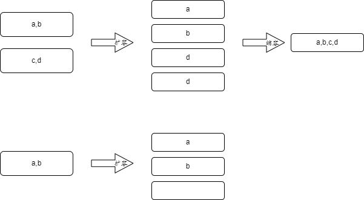

# Flink自定义状态简介

Flink中除框架自身状态外，用户可自定义状态；其中状态包括键值分区状态（`Keyed State`）和算子状态（`Operator State`），键值分区状态只能用于`KeyedStream`流，算子状态一般用于没有主键的场景，例如source、sink等。以下将详细介绍各状态和使用用例

## 自定义状态简介

### 键值分区状态（Keyed State）

keyed状态支持的状态类型如下所示：

- `ValueState<T>`: 保存一个可以更新和检索的值（如上所述，每个值都对应到当前的输入数据的 key，因此算子接收到的每个 key 都可能对应一个值）。 这个值可以通过 `update(T)` 进行更新，通过 `T value()` 进行检索。
- `ListState<T>`: 保存一个元素的列表。可以往这个列表中追加数据，并在当前的列表上进行检索。可以通过 `add(T)` 或者 `addAll(List<T>)` 进行添加元素，通过 `Iterable<T> get()` 获得整个列表。还可以通过 `update(List<T>)` 覆盖当前的列表。
- `ReducingState<T>`: 保存一个单值，表示添加到状态的所有值的聚合。接口与 `ListState` 类似，但使用 `add(T)` 增加元素，会使用提供的 `ReduceFunction` 进行聚合。
- `AggregatingState<IN, OUT>`: 保留一个单值，表示添加到状态的所有值的聚合。和 `ReducingState` 相反的是, 聚合类型可能与添加到状态的元素的类型不同。 接口与 `ListState` 类似，但使用 `add(IN)` 添加的元素会用指定的 `AggregateFunction` 进行聚合。
- `MapState<UK, UV>`: 维护了一个映射列表。 你可以添加键值对到状态中，也可以获得反映当前所有映射的迭代器。使用 `put(UK，UV)` 或者 `putAll(Map<UK，UV>)` 添加映射。 使用 `get(UK)` 检索特定 key。 使用 `entries()`，`keys()` 和 `values()` 分别检索映射、键和值的可迭代视图。你还可以通过 `isEmpty()` 来判断是否包含任何键值对。

### 算子状态（Operator State）

算子状态，支持的状态类型如下所示：

- `ListState<T>`: 保存一个元素的列表。`ListState`可以分为两种类型**Even-split redistribution**和**Union redistribution**，主要区别在于，恢复时list值是全分配还是部分分配
- `MapState<UK, UV>`: 维护了一个映射列表。也叫广播状态（`Broadcast State`）

### 算子状态和键值分区状态对比

适用范围：键值分区状态只能用于`KeyedStream`流，算子状态可以用于任何流

能否跨子任务：状态都是只能在当前子任务中访问和修改

扩容分配策略：算子状态分配策略根据不同类型拥有三种分配策略，而键值分区状态只能根据键值重分区分配

### 状态有效期

状态可配置有效期，但暂时只支持基于 *processing time* 的 TTL

## 设置状态存储格式和存储地址

在Flink1.13统一将状态存储统一修改为：

1. 设置存储格式：`RocksDBStateBackend`（二进制存储），`HashMapStateBackend`（对象存储）

2. 设置存储地址：`FileSystemCheckpointStorage`（外部文件系统），`JobManagerCheckpointStorage`（`JobManager`的JVM内存）

代码示例如下：

```java
StreamExecutionEnvironment env = StreamExecutionEnvironment.getExecutionEnvironment();
env.setRuntimeMode(RuntimeExecutionMode.AUTOMATIC);
//设置存储格式  RocksDBStateBackend HashMapStateBackend
env.setStateBackend(new HashMapStateBackend());
//设置存储地址：内存或者外部系统  FileSystemCheckpointStorage JobManagerCheckpointStorage
//设置String会使用FileSystemCheckpointStorage
env.getCheckpointConfig().setCheckpointStorage("file://" + path);
//或者设置为内存存储：env.getCheckpointConfig().setCheckpointStorage(new JobManagerCheckpointStorage());
```

## 状态保存和恢复

在状态运行时，状态在每个状态算子中都是独立存在，相互不会影响（及时相同Task的不同subTask之间的状态也不是共享的）；状态恢复时可区分为四种扩缩容机制分别是：键值分区、算子状态分区之广播状态（`MapState<UK, UV>`）、算子状态分区之`ListState`（`Even`）和算子状态分区之`ListState`（`Union`）

### 键值分区

**键值分区状态扩缩容示意图**如下：


键值分区在扩缩容时，会根据新任务的数量对键值重新分区（注意Flink并不会以单个键值作为最小单位，而是以键值组作为最小单位分配键值），如果**出现并行度多余分区数时，则子任务会空跑**

### 算子状态之广播状态

算子广播状态即`MapState<UK, UV>`，可通过两种方式使用分别是connect方式和直接作为算子状态使用

**采用`connect`方式扩缩容示意图**如下：


在扩缩容时：如果增加并行度，会将任一一个的状态（因为状态都相同）拷贝到增加的并行度中，如果减少并行度，抛弃多余状态启动（因为状态都相同）

**直接作为算子状态扩缩容示意图**如下：


将`BroadcastState`（即`MapState<UK, UV>`）直接作为算子状态，在扩缩容时：**在缩容时，但会丢失状态**！

### 算子状态分区之列表状态

列表状态可分为两种分别是普通列表和联合列表，普通列表在扩容和缩容时状态会正常的合并和分散；联合列表无论并行度是否发生变化都会将原先几个状态合并！

**普通列表状态扩缩容示意图**如下：



普通列表状态随着并行度的变化会将状态均匀的分配给每个子任务，当扩容并行度多余状态时，会有一个子任务将没有状态。

**联合列表状态扩缩容示意图**如下：


通过联合列表状态重启，重启后的状态都是前面状态的总和！
