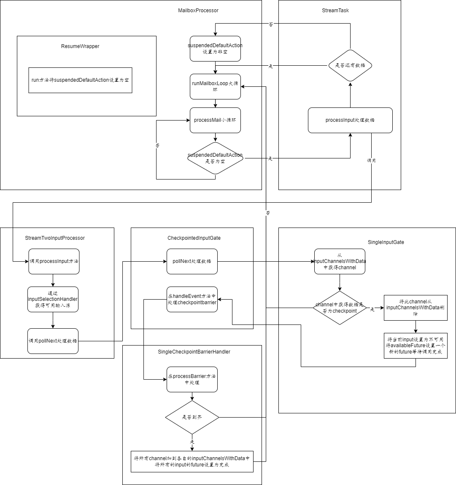

### 源码解析Flink非源端多输入算子在checkpoint前，如何暂停处理数据

Flink版本：1.13.6

#### 设计思路

对于多输入算子，如果一个输入源有`checkpointBarrier`到达，则等待其它输入源，直到所有输入源的`checkpointBarrier`都到齐，才进行checkpoint。

本文对`TwoInputStreamTask`的输入`StreamTwoInputProcessor`进行分析，分析多输入端是如何暂停计算进行checkpoint和恢复计算

#### 实现思路

流程图如下图所示：



上半部，当没有数据、`checkpointBarrier`时，线程会一直在`ProcessMail`小循环（一些控制类消息）直到有数据（数据、`checkpointBarrier`等）；当有数据时，处理这条数据就会去检查一下是否有mail需要处理；线程会在mail处理和数据处理之间来回切换

下半部，当`StreamTwoInputProcessor`一个输入源接收到`checkpoint`时会将当前输入源（`SingleInputGate`）设置为不可利用，并判断所有输入源`checkpointBarrier`是否到达；如果全部到达，则进行`checkpoint`，处理完成以后，会将所有输入源设置为可用状态。

#### 代码实现

##### 阻塞和恢复公共代码

追踪代码发现TaskManagerGateway.submitTask方法可向TaskManager提交任务，任务的核心逻辑在StreamTask的runMailboxLoop方法中。该方法会调用MailboxProcessor.runMailboxLoop()进入数据处理循环，如下所示

```java
//代码片段一：大循环
public void runMailboxLoop() throws Exception {
        suspended = !mailboxLoopRunning;

        final TaskMailbox localMailbox = mailbox;

        checkState(
                localMailbox.isMailboxThread(),
                "Method must be executed by declared mailbox thread!");

        assert localMailbox.getState() == TaskMailbox.State.OPEN : "Mailbox must be opened!";

        final MailboxController defaultActionContext = new MailboxController(this);
		//循环执行直到被打断！
        while (isNextLoopPossible()) {
            //processMail中会有一个小循环在本类的processMailsWhenDefaultActionUnavailable方法中，该循环是否继续由本类的suspendedDefaultAction变量控制（为非空继续循环，为空跳出循环）
            processMail(localMailbox, false);
            if (isNextLoopPossible()) {
                //mailboxDefaultAction是一个函数式接口，实际调用的是StreamTask.processInput方法
                mailboxDefaultAction.runDefaultAction(
                        defaultActionContext); 
            }
        }
    }
```

上述```mailboxDefaultAction.runDefaultAction(defaultActionContext)```实际调用的是StreamTask.processInput方法（TwoInputStreamTask继承StreamTask），代码实现如下：

```java
//代码片段二：TwoInputStreamTask extend StreamTask->processInput处理数据
protected void processInput(MailboxDefaultAction.Controller controller) throws Exception {
    //处理数据：数据或checkPointBarrier等
    //当是checkpointBarrier会返回InputStatus.MORE_AVAILABLE
    //当没有数据时，会返回InputStatus.NOTHING_AVAILABLE
    InputStatus status = inputProcessor.processInput();
    if (status == InputStatus.MORE_AVAILABLE && recordWriter.isAvailable()) {
        return;
    }
    if (status == InputStatus.END_OF_INPUT) {
        controller.allActionsCompleted();
        return;
    }
    //没有可用数据
    TaskIOMetricGroup ioMetrics = getEnvironment().getMetricGroup().getIOMetricGroup();
    TimerGauge timer;
    CompletableFuture<?> resumeFuture;
    if (!recordWriter.isAvailable()) {
        timer = ioMetrics.getBackPressuredTimePerSecond();
        resumeFuture = recordWriter.getAvailableFuture();
    } else {
        timer = ioMetrics.getIdleTimeMsPerSecond();
        resumeFuture = inputProcessor.getAvailableFuture();
    }
    assertNoException(
            resumeFuture.thenRun(
                    new ResumeWrapper(controller.suspendDefaultAction(timer), timer)));
}
```

根据TwoInputStreamTaskcreateInputProcessor方法可知，上述processInput方法是调用的StreamTwoInputProcessor类中方法，该类中有封装了两个StreamOneInputProcessor，并判断每个processor的返回结果和当前可用状态选择其中一个作为输入源，并调用其processInput方法处理数据

```java
//StreamTwoInputProcessor -> processInput
@Override
public InputStatus processInput() throws Exception {
    int readingInputIndex;
    if (isPrepared) {
        //获得下一个可用输入（根据input的availableFuture是否为空，判断是否可用！）
        readingInputIndex = selectNextReadingInputIndex();
    } else {
   		//先初始化，然后调用selectNextReadingInputIndex
        readingInputIndex = selectFirstReadingInputIndex();
    }
    // In case of double notification (especially with priority notification), there may not be
    // an input after all.
    if (readingInputIndex == InputSelection.NONE_AVAILABLE) {
        return InputStatus.NOTHING_AVAILABLE;
    }
    lastReadInputIndex = readingInputIndex;

    if (readingInputIndex == 0) {
        //调用StreamOneInputProcessor的processInput方法
        firstInputStatus = processor1.processInput();
    } else {
        secondInputStatus = processor2.processInput();
    }
    inputSelectionHandler.nextSelection();

    return getInputStatus();
}
```

进入StreamOneInputProcessor的processInput方法

```java
//StreamOneInputProcessor -> processInput
@Override
public InputStatus processInput() throws Exception {
    //参考StreamTwoInputProcessorFactory的create方法代码，可知input是StreamTaskNetworkInput类，
    //实际为调用StreamTaskNetworkInput的emitNext(该方法继承AbstractStreamTaskNetworkInput的方法)
    InputStatus status = input.emitNext(output);

    if (status == InputStatus.END_OF_INPUT) {
        endOfInputAware.endInput(input.getInputIndex() + 1);
    } else if (status == InputStatus.END_OF_RECOVERY) {
        if (input instanceof RecoverableStreamTaskInput) {
            input = ((RecoverableStreamTaskInput<IN>) input).finishRecovery();
        }
        return InputStatus.MORE_AVAILABLE;
    }

    return status;
}
```

调用StreamTaskNetworkInput的emitNext(继承AbstractStreamTaskNetworkInput的方法)

```java
//AbstractStreamTaskNetworkInput -> emitNext
@Override
public InputStatus emitNext(DataOutput<T> output) throws Exception {
while (true) {
    // get the stream element from the deserializer
    if (currentRecordDeserializer != null) {
        RecordDeserializer.DeserializationResult result;
        try {
            result = currentRecordDeserializer.getNextRecord(deserializationDelegate);
        } catch (IOException e) {
            throw new IOException(
                    String.format("Can't get next record for channel %s", lastChannel), e);
        }
        if (result.isBufferConsumed()) {
            currentRecordDeserializer = null;
        }

        if (result.isFullRecord()) {
            processElement(deserializationDelegate.getInstance(), output);
            return InputStatus.MORE_AVAILABLE;
        }
    }
	//处理checkpointBarrier和阻塞channel
    Optional<BufferOrEvent> bufferOrEvent = checkpointedInputGate.pollNext();
    if (bufferOrEvent.isPresent()) {
        // return to the mailbox after receiving a checkpoint barrier to avoid processing of
        // data after the barrier before checkpoint is performed for unaligned checkpoint
        // mode
        if (bufferOrEvent.get().isBuffer()) {
            processBuffer(bufferOrEvent.get());
        } else {
            return processEvent(bufferOrEvent.get());
        }
    } else {
        if (checkpointedInputGate.isFinished()) {
            checkState(
                    checkpointedInputGate.getAvailableFuture().isDone(),
                    "Finished BarrierHandler should be available");
            return InputStatus.END_OF_INPUT;
        }
        return InputStatus.NOTHING_AVAILABLE;
    }
}
}
```

在CheckpointedInputGate中处理checkpointBarrier和阻塞channel

```java
//CheckpointedInputGate-> pollNext
@Override
public Optional<BufferOrEvent> pollNext() throws IOException, InterruptedException {
    //阻塞过程
    //获得数据，并根据数据情况判断是否需要阻塞当前input SingleInputGate->pollNext方法
    Optional<BufferOrEvent> next = inputGate.pollNext();

    if (!next.isPresent()) {
        return handleEmptyBuffer();
    }

    BufferOrEvent bufferOrEvent = next.get();

    if (bufferOrEvent.isEvent()) {
        //解锁过程
        //处理ck并判断是否需要ck
        return handleEvent(bufferOrEvent);
    } else if (bufferOrEvent.isBuffer()) {
        barrierHandler.addProcessedBytes(bufferOrEvent.getBuffer().getSize());
    }
    return next;
}
```

##### 阻塞

在SingleInputGate中使用inputChannelsWithData队列保存可用channel，当当前获得数据是checkpointBarrier时，1.channel将不会再放回到队列中，2. SingleinputGate的availableFuture变量设置为一个新的future；步骤1用于阻塞，步骤2用于阻塞恢复

```java
//SingleInputGate ->pollNext->getNextBufferOrEvent
private Optional<InputWithData<InputChannel, BufferAndAvailability>> waitAndGetNextData(
            boolean blocking) throws IOException, InterruptedException {
        while (true) {
            synchronized (inputChannelsWithData) {
                Optional<InputChannel> inputChannelOpt = getChannel(blocking);
                if (!inputChannelOpt.isPresent()) {
                    return Optional.empty();
                }

                final InputChannel inputChannel = inputChannelOpt.get();
                //获得数据
                Optional<BufferAndAvailability> bufferAndAvailabilityOpt =
                        inputChannel.getNextBuffer();

                if (!bufferAndAvailabilityOpt.isPresent()) {
                    checkUnavailability();
                    continue;
                }

                final BufferAndAvailability bufferAndAvailability = bufferAndAvailabilityOpt.get();
                //moreAvailable实际是判断返回数据是否为非None.Type类型，恰好ck是None.Type类型，所以当前inputChannel不会加入到inputChannelsWithData中，从而达到阻塞效果
                if (bufferAndAvailability.moreAvailable()) {
                    // enqueue the inputChannel at the end to avoid starvation
                    queueChannelUnsafe(inputChannel, bufferAndAvailability.morePriorityEvents());
                }

                final boolean morePriorityEvents =
                        inputChannelsWithData.getNumPriorityElements() > 0;
                if (bufferAndAvailability.hasPriority()) {
                    lastPrioritySequenceNumber[inputChannel.getChannelIndex()] =
                            bufferAndAvailability.getSequenceNumber();
                    if (!morePriorityEvents) {
                        priorityAvailabilityHelper.resetUnavailable();
                    }
                }
				//如果是inputChannelsWithData为空，则阻塞当前InputGate，（目前一个inputChannelsWithData只会有一个channel，所以这里InputGate会被设置为不可用）
                checkUnavailability();

                return Optional.of(
                        new InputWithData<>(
                                inputChannel,
                                bufferAndAvailability,
                                !inputChannelsWithData.isEmpty(),
                                morePriorityEvents));
            }
        }
    }
```

##### 恢复

在所有InputChannel收到checkpointBarrier时，开始checkpoint，完成checkpoint后将InputChannel加入到各自的可用池中；并将AvailabilityHelper设置为可用

```java
//CheckpointedInputGate->handleEvent
private Optional<BufferOrEvent> handleEvent(BufferOrEvent bufferOrEvent) throws IOException {
        Class<? extends AbstractEvent> eventClass = bufferOrEvent.getEvent().getClass();
        if (eventClass == CheckpointBarrier.class) {
            CheckpointBarrier checkpointBarrier = (CheckpointBarrier) bufferOrEvent.getEvent();
            //处理每条checkpointBarrier（SingleCheckpointBarrierHandler->processBarrier）
            barrierHandler.processBarrier(checkpointBarrier, bufferOrEvent.getChannelInfo());
        } else if (eventClass == CancelCheckpointMarker.class) {
            barrierHandler.processCancellationBarrier(
                    (CancelCheckpointMarker) bufferOrEvent.getEvent());
        } else if (eventClass == EndOfPartitionEvent.class) {
            barrierHandler.processEndOfPartition();
        } else if (eventClass == EventAnnouncement.class) {
            EventAnnouncement eventAnnouncement = (EventAnnouncement) bufferOrEvent.getEvent();
            AbstractEvent announcedEvent = eventAnnouncement.getAnnouncedEvent();
            checkState(
                    announcedEvent instanceof CheckpointBarrier,
                    "Only CheckpointBarrier announcement are currently supported, but found [%s]",
                    announcedEvent);
            CheckpointBarrier announcedBarrier = (CheckpointBarrier) announcedEvent;
            barrierHandler.processBarrierAnnouncement(
                    announcedBarrier,
                    eventAnnouncement.getSequenceNumber(),
                    bufferOrEvent.getChannelInfo());
        } else if (bufferOrEvent.getEvent().getClass() == EndOfChannelStateEvent.class) {
            upstreamRecoveryTracker.handleEndOfRecovery(bufferOrEvent.getChannelInfo());
        }
        return Optional.of(bufferOrEvent);
    }
//AbstractAlignedBarrierHandlerState -> barrierReceived
@Override
public final BarrierHandlerState 
    (
        Controller controller,
        InputChannelInfo channelInfo,
        CheckpointBarrier checkpointBarrier)
        throws IOException, CheckpointException {
    checkState(!checkpointBarrier.getCheckpointOptions().isUnalignedCheckpoint());
    state.blockChannel(channelInfo);
    if (controller.allBarriersReceived()) {
        //触发checkpoint
        controller.triggerGlobalCheckpoint(checkpointBarrier);
        //将所有channel加入到各自的inputChannelsWithData队列中
        state.unblockAllChannels();
        return new WaitingForFirstBarrier(state.getInputs());
    }

    return convertAfterBarrierReceived(state);
}

```

#### 总结

Flink中为保证Checkpoint的准确性，在多输入源中，通过控制每个inputGate的availableFuture（主要用于判断是否可用）和inputChannelsWithData（直接控制数据返回，以免再次请求拿到数据）来实现阻塞；在checkpoint完成同步阶段后，标记availableFuture为完成，将每个channel放回inputChannelsWithData中，从而实现恢复数据处理。


当所有channel没有数据时，返回会跳到mail循环，什么时候才会跳出了？
