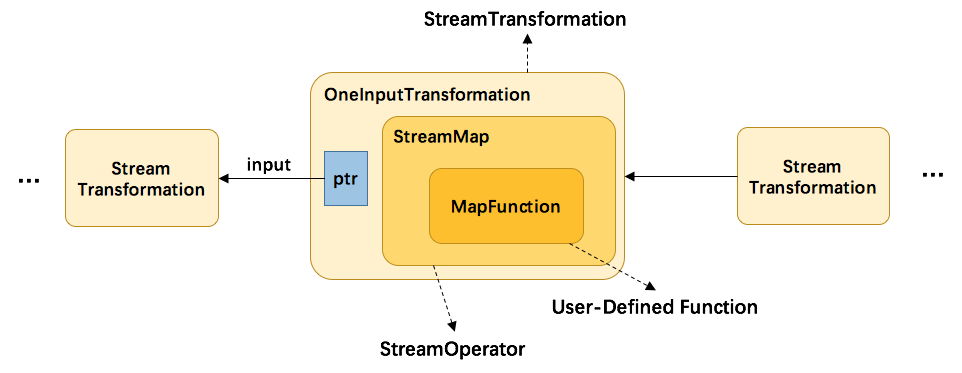

# DataStream设计与实现

​	DataStream代表一系列同类型数据的集合，可以通过转换操作生成新的DataStream，DataStream主要成员：`StreamExecutionEnvironment`和`Transformation`；

​	`Transformation`是一个抽象类，`Transformation`的构造如下所示，主要成员包括指向前一个的指针和操作`StreamOperator`（实际是`StreamOperatorFactory`，在运行时创建`StreamOperator`）；实现的类`Transformation`分为两种，第一种类实现`PhysicalTransformation`抽象类（继承`Transformation`）支持链化；第二种直接继承`Transformation`，不支持链化；

通过代码和上述图可知：首先自定义的函数封装到`StreamOperator`中，然后将`StreamOperator`封装到`Transformation`中，最后将`Transformation`写入`StreamExecutionEnvironment`提供的`Transformations`中，运行时即可通过`Transformations`生成`StreamGraph`用于生成`JobGraph`。

接下来主要了解`StreamOperator`、生成`StreamOperator`的工厂类`StreamOperatorFactory`和`Function`

### StreamOperator定义和实现

​	`Transformation`负责描述DataStream之间的转换信息，而`StreamOperator`提供了执行`Function`的环境，包括状态数据管理和处理`WaterMark`、`LatencyMark`等等；`StreamOperator`类实现关系图如下所示（虚线是实现，实线是继承（因为继承拿的东西多，所以是实线:)  ））

`StreamOperator`是一个接口，其中比较重要的两个继承类是`OneInputStreamOperator`和`TwoInputStreamOperator`，用于支持单输入流和多输入流算子；单输入流算子实现有`ProcessOperator`和`StreamSink`等，多输入流实现有`CoProcessOperator`等；

​	`StreamOperator`还有一些公共实现抽象类`AbstractStreamOperator`和`AbstractUdfStreamOperator`,其中`AbstractUdfStreamOperator`增加`UserFunction`成员变量，允许当前算子自定义计算逻辑！

### StreamOperatorFactory

​	`StreamOperator`是通过`StreamOperatorFactory`封装在`Transformation`中，在运行调用`createStreamOperator`方法即可获得`StreamOperator`实例；`StreamOperatorFactory`类图如下所示：

`UdfOperatorFactory`主要用于生成`processOperator`，另外两个分别生成`source`和`sink`的`Operator`

### Function

Function是Flink最小的数据处理单元，主要继承接口有`MapFunction`、`RichFunction`等，其中`RichFunction`提供获取`RuntimeContext`的能力；

`RuntimeContext`提供算子执行过程中所有运行的上下文信息，有多种实现类用于不同场景，其中流式数据处理中使用最多的是`StreamingRuntimeContext`。

#### SourceFunction

`SourceFunction`函数定义了run方法用于实现客户端代码执行和内部类`SourceContext`用于读取上下文信息；

`SourceContext`有两类实现：`NonTimestampContext`（对应的是处理时间）和`WatermarkContext`（`AutomaticWatermarkContext`和`ManualWatermarkContext`分别对应的是接入时间和事件时间）

`SourceFunction`定义完成后封装在`StreamSource`中，在`StreamSource`中会创建`LatencyMarksEmitter`和`SourceContext`，最后调用`userFunction.run(ctx)`方法

#### SinkFunction

SinkFunction通常情况下实现类都是RichSinkFunction（TwoPhaseCommitSinkFunction继承自RichSinkFunction）；SinkContext相较于SourceContext简单一些，仅包含一些基本方法。

#### ProcessFunction

processFunction主要继承自AbstractRichFunction，有两个内部内Context和OnTimerContext（继承自Context，应用在OnTimer方法中用于定时处理时获得上下文信息）

### TimerService

每个Operator内部都会维系一个TimerService，专门用于处理与时间相关的操作，例如获得当前处理时间、Watermark、注册定时器等等！

#### 时间概念&Watermark

在 Flink 中，时间概念主要分为三种类型，即事件时间、处理时间以及接入时间，定义和使用范围如下：

| 概念类型       | 事件时间                                         | 处理时间                                   | 接入时间                                    |
| -------------- | ------------------------------------------------ | ------------------------------------------ | ------------------------------------------- |
| 产生时间       | 事件产生的时间，通过数据中的某个时间字段抽取获得 | 数据在流系统中处理所在算子的计算机系统时间 | 数据在接人Flink的过程中由接入算子产生的时间 |
| Watermark 支持 | 基于事件时间生成Watermark                        | 不支持生成Watermark                        | 支持自动生成Watermark                       |
| 时间特性       | 能够反映数据产生的先后顺序                       | 仅表示数据在处理过程中的先后关系           | 表示数据接入过程的先后关系                  |
| 应用范围       | 结果确定，可以复现每次数据处理的结果             | 无法复现每次数据处理的结果                 | 无法复现每次数据处理的结果                  |

Timestamp和Watermark可以通过三种方式定义分别是：源端生成、独立算子抽取、通过连接器提供的接口抽取

#### TimerService时间服务

​	主要的接口有TimerService（默认实现有SimpleTimerService）和InternalTimerService，SimpleTimerService会将InteralTimerService 接口作为内部成员变量，在SimpleTimerService中提供的方法基本上都是借助InternalTimerService 实现的；

