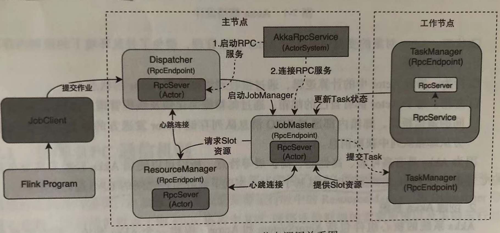
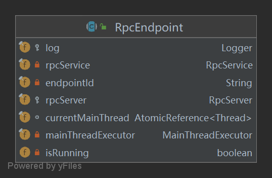
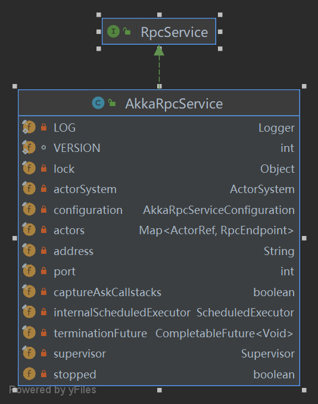
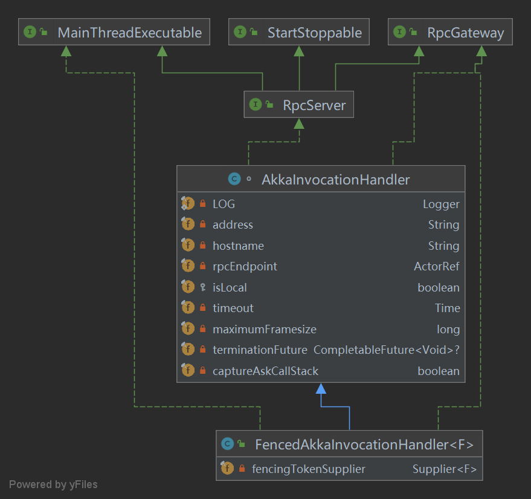

# Flink中RPC实现原理简介

## 前提知识

Akka是一套可扩展、弹性和快速的系统，为此Flink基于Akka实现了一套内部的RPC通信框架；为此先对Akka进行了解

### Akka

Akka是使用Scala语言编写的库，基于Actor模型提供一个用于构建可扩展、弹性、快速响应的系统；并被应用到Flink中，基于Akka实现了集群组件之间的RPC通信框架

#### Actor模型

Actor模型是一个通用的并发编程模型，**该模型独立维护隔离状态，基于消息传递实现异步通信**，大致可以理解为三部分：

- 邮箱：每个`actor`持有一个邮箱（mailbox），本质上是一个队列，用于存储消息。
- 行为：每个`actor`可以发送消息至任何`actor`。
- 状态：每个`actor`可以通过处理消息来更新内部状态，对于外部而言，`actor`的状态是隔离的状态，避免了并发环境下的锁和内存原子性问题

#### Akka系统组成

Akka系统核心包括两个组件：`ActorSystem`和`Actor`（使用demo可以[参考这里](https://github.com/BaoPiao/blog/tree/net/akka)）

- 只能通过`ActorSystem.actorOf`和`ActorContext.actorOf`创建`Actor`，不允许直接创建`Actor`
- 只能通过`ActorRef`发送消息与`Actor`通信

## Flink的RPC框架

Flink的RPC框架基于Akka实现，其中Flink集群中实现RPC通信节点功能主要有：`Dispacher`，`ResourceManager`，`TaskManager`，`TaskManager`；这些节点分别继承了`RpcEndPoint`抽象类，并在实现类中初始化各自`RpcServer`（类似于`Actor`）来提供本地和远程代码请求；`RpcServer`的创建和启动都是由`RpcService`（主要实现`AkkaRpcService`，封装`ActorSystem`）来完成，此外一个`RpcService`可以创建多个`RpcServer`；详细的调用链路图如下所示

### RpcEndPoint

`RpcEndPoint`代表RPC组件的端点，需要实现RPC通信的都需要实现`RpcEndPoint`，主要成员变量如下

- `rpcServer`用于完成本地和远程调用能力

- `rpcService`是的`rpcService`引用，`rpcService`可用于启动/关闭当前`rpcServer`（`rpcServer`中封装了`ActorRef`）

- `mainThreadExecutor`封装了`MainThreadExecutable`接口（`RpcServer`接口继承了`MainThreadExecutable`），用于实现本地调用
- `endpointId`用于唯一标识当前的`RpcEndPoint`

### AkkaRpcService

`AkkaRpcService`负责创建启动Flink集群`RpcEndPoint`端点中的`RpcServer`组件，且`AkkaRPCService`在集群创建时就会启动完毕；UML类图如下所示

属性：

- `actorSystem`是引用Akka的`ActorSystem`，可以用于启动、停止`actor`（启动、停止`rpcServer`）
- `actors`用于存储创建的`RpcEndPoint`的实现类（类中会封装`actor`）

方法：

- `startServer()`用于启动RpcServer，启动完成后这能对外提供服务
- `connect()`用于连接远端RpcEndpoint，并返回调用方RpcGateway接口的代理类，获得调用外部的能力

### RpcServer

RpcServer是一个接口类，实际是对`Actor`的封装，该类实现类有`AkkaInvocationHandler`和`FencedAkkaInvocationHandler`；`AkkaInvocationHandler`中封装有`ActorRef`，并通过动态代理技术（InvocationHandler）实现远程和本地方法调用

`RpcServer`中`RpcGateWay`、`MainThreadExecutable`和`StartStoppable`接口的方法，都会通过代理实现；方法中会查看调用方法实现类，来判断本地调用还是通过`RefActor`发送远程RPC调用

### 小结

Flink中每个需要使用RPC的组件都会实现`RpcEndpoint`，每个`RpcEndpoin`中都会包含两个属性`RpcService`和`RpcServer`；其中`RpcService`封装了`AkkaSystem`，`RpcServer`封装了`ActorRef`，最终通过动态代理技术实现方法的调用

参考资料

书籍：Flink设计与实现

博客：https://cloud.tencent.com/developer/news/698662